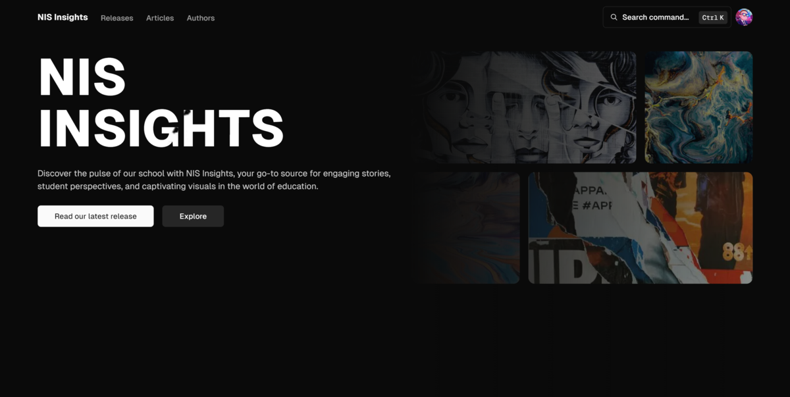

# [NIS Insights](https://nis-insights.vercel.app)

This is an open source e-commerce skateshop build with everything new in Next.js 13. It is bootstrapped with `create-t3-app`.

Discover the pulse of our school with NIS Insights, your go-to source for engaging stories, student perspectives, and captivating visuals in the world of education.

> **Warning**
> This project is still in development and is not ready for production use.

## Table of contents

- [Project Name](#project-name)
  - [Table of Contents](#table-of-contents)
  - [Tech stack](#tech-stack)
  - [Introduction](#introduction)
  - [Features](#features)
  - [Getting Started](#getting-started)
    - [Prerequisites](#prerequisites)
    - [Installation](#installation)
  - [Usage](#usage)
  - [Contributing](#contributing)
  - [License](#license)
  - [Acknowledgments](#acknowledgments)

## Tech Stack

- **Framework:** [Next.js](https://nextjs.org)
- **Styling:** [Tailwind CSS](https://tailwindcss.com)
- **User Management:** [NextAuth](https://next-auth.js.org)
- **ORM:** [Prisma](https://www.prisma.io/)
- **UI Components:** [shadcn/ui](https://ui.shadcn.com)
<!-- - **File Uploads:** [uploadthing](https://uploadthing.com) -->

## Features to be implemented

Frontend Development:

- [x] Home page
- [x] Sign in/out pages
- [ ] Release/(-s) pages
- [ ] Article/(-s) pages
- [ ] Dashboard/Account pages
- [ ] New article page:
  - [ ] Markdown rendering (fully optimized)
  - [ ] Editor (fully optimized)

Backend Development:

- [x] Authentication with NextAuth
- [ ] Database models
  - [x] User
  - [ ] Article
  - [ ] Release
  - [ ] Comments
- [ ] Data mutations/fetching

Security:

- [ ] Authorization
- [ ] Data handling (Data Access Layer)

Performance:

- [ ] Bundle analyzing and reducing JS
- [ ] Image optimization
- [ ] Responsive design

## Introduction

NIS Insights is the digital home of our school magazine club. Explore our latest releases, read engaging articles, and discover talented authors on our platform. We're dedicated to sharing knowledge, creativity, and unique perspectives.

## Features

- Browse and read our latest releases.
- Explore a variety of articles covering diverse topics.
- Learn about the talented authors behind the content.
- Join us as a member to contribute your own articles.

## Getting Started

Get started with NIS Insights and become a part of our community.

## Usage

Visit our website to:

- Read the latest releases and articles.
- Learn more about our featured authors.
- Join us as a member to contribute your own articles.

## Contributing

We welcome new members and contributors to enhance our platform. To contribute:

1. Fork the repository.
2. Create a new branch.
3. Make your changes and commit them.
4. Open a pull request.

Please note that we are selective about contributors to maintain the quality of our content.

## License

This project is licensed under the [MIT License](LICENSE). See the [LICENSE](LICENSE) file for details.

## Acknowledgments

- Thank you to our dedicated team of writers and contributors.
- Inspired by the passion for sharing knowledge within our school community.
